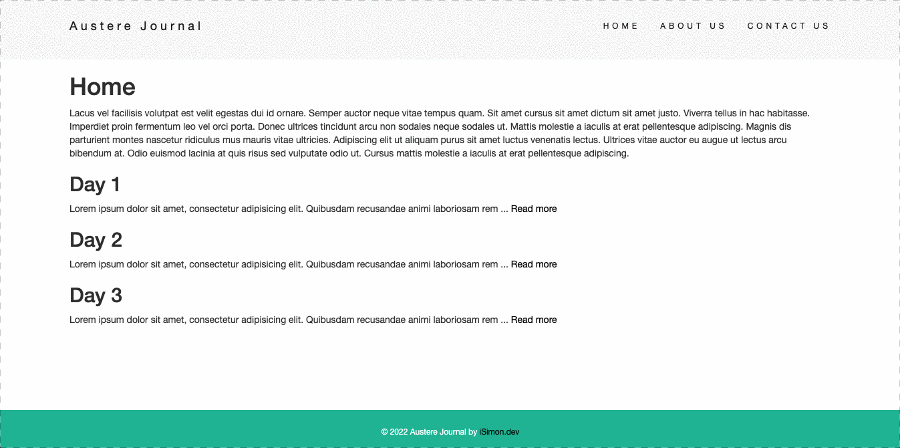
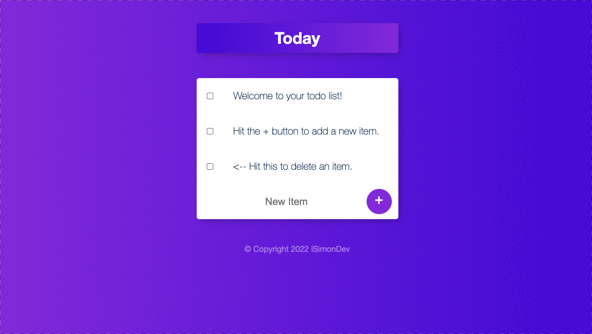

  Hi 👋

  I'm Isaiah Simon, and I'm a Software Engineer with a background in pharmaceutical technology, finance and business.

  My prior experiences motivate me to use technology as a positive tool for change.

  You can find out more about me here...  
  

<h1 align="center">Latest Projects...</h1>

<table bordercolor="#66b2b2">
  <!-- First row -->
  <tr>
    <!-- Austere Blog -->
    <td width="50%" valign="top">
      <h3 align="center">Austere Blog</h3>
       
      
       
      

        
        
      

      
<strong>JavaScript, Node.js, Express.js, EJS, Mongoose, MongoDB, Heroku, Lodash, HTML5, CSS3</strong>

      
A minimalistic personal blog generated using EJS layout and templating!

    </td>
    <!-- Remembr -->
    <td width="50%" valign="top">
      <h3 align="center">Remembr</h3>
       
      
       
      

        
        
      

      
<strong>JavaScript, Node.js, Express.js, EJS, Mongoose, MongoDB, Heroku, Lodash, HTML5, CSS3</strong>

      
Remembr is a full-stack ToDo list app that can dynamically generate additional custom lists!

    </td>
  </tr>
  <!-- Second Row -->
  <tr>
    <!-- Newsletter Signup -->
    <td width="50%" valign="top">
      <h3 align="center">Newsletter Signup</h3>
       
      
       
      

        
        
      

      
<strong>JavaScript, Node.js, Express.js, Heroku, Bootstrap, HTML5, CSS3</strong>

      
A personal newsletter sign up app with Mailchimp API integration!

    </td>
    <!-- Portfolio Website -->
    <td width="50%" valign="top">
      <h3 align="center">iSimon.dev</h3>
       
      
       
      

        
      

      
<strong>JavaScript, HTML5, CSS3, Netlify</strong>

      
My Portfolio website for prospective clients, featuring my latest client projects and other related info.
        Features a dynamic HTML5 Canvas element.

    </td>
  </tr>

</table>

<h1 align="center">Technology</h1>

<table>
  <tr>
    <td>
      <h3 align="center">Core</h3>
      

        
        
        
        
      

    </td>
    <td>
      <h3 align="center">Frameworks / Libraries</h3>
      

        
        
        
        
        
        
      

    </td>
  </tr>
  <tr>
    <td>
      <h3 align="center">Databases</h3>
      

        
        
      

    </td>
    <td>
      <h3 align="center">Tools</h3>
      

        
        
        
        
        
        
        
      

    </td>
  </tr>
</table>

  ---
<h1 align="center">Stats</h1>
<table>
  <tr>
    <td>
      

      

        

    </td>
    <td>
      
&nbsp;

      

    </td>
  </tr>
</table>

---

<h1 align="center">Writing (Coming soon!)</h1>

  I've developed a consistent habit of writing down my daily notes and thoughts.
  This allows me to reflect on some of the challenges/obstacles I encounter while coding, and the steps I took to
  resolve them.

  I'll be sharing some of these experiences on my new blog, <a href="https://www.simonara.com"
    target="_blank">Simonara</a> and you can check it out over at hashnode!

---

<h1 align="center">Connect</h1>

  

---
