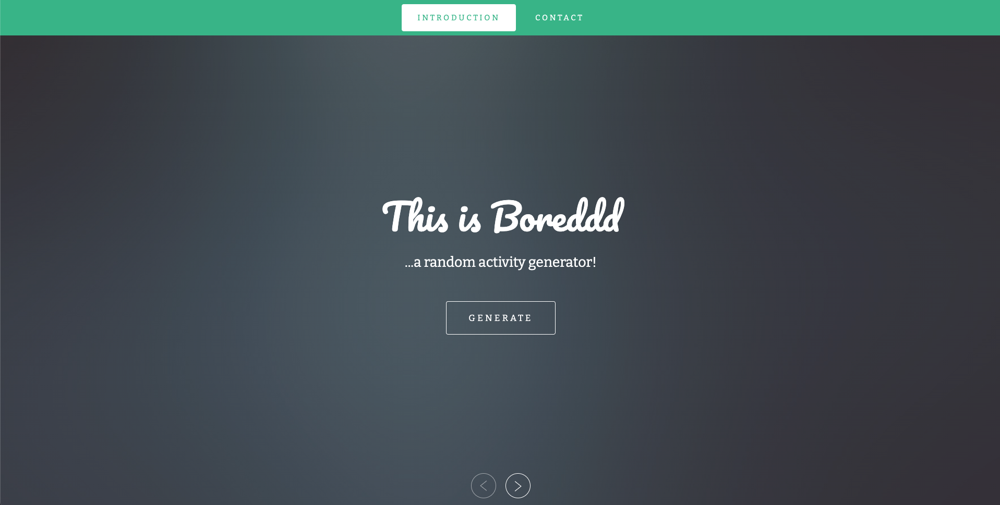

I'm a Software Engineer with a background in Pharmaceutical Technology, Finance and Business Management. My experience in healthcare motivates me to use technology as a positive tool for change.

Check out  to find out more about me!  

<h1 align="center">Latest Projects...</h1>

<table bordercolor="#66b2b2">
    <!-- First row -->
    <tr>
    <!-- Blog Website -->
    <td width="50%" valign="top">
      <h3 align="center">Austere Blog</h3>
       
        
       
        

  
  
      

      
<strong>HTML/CSS/JavaScript, Bootstrap, Node.js, Express.js, EJS, Lodash</strong>

      
A minimalistic personal blog

    </td>
    <!-- Newsletter Signup -->
    <td width="50%" valign="top">
      <h3 align="center">Newsletter Signup</h3>
         
        
         
        

  </a>
  
  
      

        
<strong>HTML/CSS/JavaScript, Bootstrap, Node.js, Express.js, Heroku</strong>

        
A newsletter signup app deployed on Heroku with Mailchimp API integration.

    </td>
  </tr>
  <!-- Second Row -->
    <tr>
    <!-- Jazzie's Art -->
    <td width="50%" valign="top">
      <h3 align="center">Jazzie's Art</h3>
       
        
       
        

  
  
      

        
<strong>HTML/CSS/JavaScript</strong>

        
An efficient and responsive website with a focus on displaying digital artwork and character designs.

    </td>
    <!-- Make it Mirsada -->
    <td width="50%" valign="top">
      <h3 align="center">Make it Mirsada</h3>
         
        
         
        

  </a>
  
      

        
<strong>HTML/CSS/JavaScript</strong>

        
A beautiful responsive website that strikes a balance between being aesthetically appealing and showcasing the artist’s work.

    </td>
  </tr>
  <!-- Third Row -->
  <tr>
    <!-- Portfolio Website -->
    <td width="50%" valign="top">
      <h3 align="center">iSimon.dev</h3>
         
        
         
        

  
      

        
<strong>HTML/CSS/JavaScript</strong>

        
Portfolio Site including links to my projects and ways to get in contact with me.

    </td>
    <!-- Boreddd -->
    <td width="50%" valign="top">
      <h3 align="center">Boreddd</h3>
         
      
         
        

  
  
      

        
<strong>HTML/CSS/JavaScript</strong>

        
A random activity generator that gives you fun and interesting things to do when you're bored!

    </td>
  </tr>

</table>

<h1 align="center">Technologies</h1>

    
    
    
    
    
    
    
    
    
    
    
    
    
    
    
    
    
    

---

<h1 align="center">Writing (Coming soon!)</h1>
I've developed a consistent habit of writing down my daily notes and thoughts in a "devlog". It allows me to reflect on some of the challenges/obstacles I encounter while coding, and the steps I took to resolve them. I'll be sharing some of these experiences on my new blog, <a href="https://www.simonara.com" target="_blank">Simonara</a> and you can check it out over at hashnode!

---
<h1 align="center">GitHub Stats</h1>

&nbsp;

---

<h1 align="center">Connect</h1>

  

